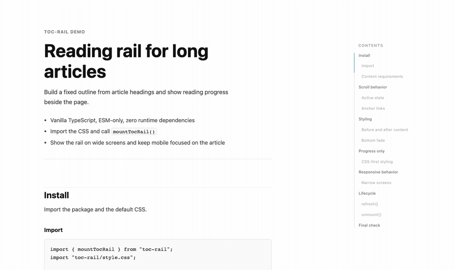

# toc-rail

Sticky reading rail with table-of-contents links, scroll progress, and active
heading state. Vanilla TypeScript, ESM-only, zero runtime dependencies.



It is a TOC library, but positioned as a reading rail: outline links, scroll
progress, active heading state, responsive hiding, and a lifecycle handle in one
small package.

```sh
npm install toc-rail
```

```js
import { mountReadingRail } from "toc-rail";
import "toc-rail/style.css";

const rail = mountReadingRail({
  content: "article",
  headings: "article h2[id], article h3[id]",
  minWidth: 1140,
  topOffset: 56
});

rail.refresh();
rail.unmount();
```

## Why

`toc-rail` is intentionally smaller than full documentation navigation systems:
it does not own routing, smooth scrolling, markdown parsing, or framework state.
It mounts a rail, keeps it in sync with scroll position, and gives you
`refresh()`, `update()`, and `unmount()` for dynamic pages.

Use it when you want:

- TOC links and reading progress in one rail
- automatic responsive hiding
- client-side cleanup for route transitions
- CSS tokens instead of a theme runtime

## Integrations

React:

```jsx
useEffect(() => {
  const rail = mountReadingRail({ content: "article" });
  return () => rail.unmount();
}, []);
```

Vue:

```js
let rail;
onMounted(() => (rail = mountReadingRail({ content: "article" })));
onUnmounted(() => rail?.unmount());
```

Svelte:

```js
onMount(() => {
  const rail = mountReadingRail({ content: "article" });
  return () => rail.unmount();
});
```

## Options

| Option | Type | Default | Notes |
| --- | --- | --- | --- |
| `content` | `string \| Element` | required | Article body or selector. |
| `headings` | `string \| Iterable<Element> \| false` | `h2[id], h3[id]` | Use `false` for progress-only mode. |
| `container` | `Element` | `document.body` | Where the rail is appended. |
| `title` | `string \| false` | `"Contents"` | Use `false` to hide the title. |
| `ariaLabel` | `string` | `"Table of contents"` | Navigation label. |
| `minWidth` | `number` | `1140` | Hide the rail below this viewport width. |
| `topOffset` | `number` | `52` | Fixed header offset. |
| `activeOffset` | `number` | `32` | Active-heading threshold below `topOffset`. |
| `edge` | `object` | enabled | Before/after content visibility settings. |
| `classes` | `object` | none | Extra class hooks for root, links, active item. |
| `getHeadingText` | `function` | textContent cleaner | Custom heading text reader. |
| `idPrefix` | `string` | `toc-rail-section` | Prefix for generated heading IDs. |
| `scrollingClassDuration` | `number` | `1400` | Duration for `.is-scrolling`. |

Use stable heading IDs:

```html
<h2 id="installation">Installation</h2>
```

If a heading has no `id`, toc-rail assigns one on the client so links can work.
For SSR or hydrated apps, explicit IDs are safer because regenerated markup can
replace client-assigned IDs.

## Styling

Import the default CSS and override tokens:

```css
.toc-rail {
  --toc-rail-accent: #197ca8;
  --toc-rail-width: 184px;
  --toc-rail-right: 2rem;
}
```

| Token | Default |
| --- | --- |
| `--toc-rail-accent` | `#197ca8` |
| `--toc-rail-line` | `rgba(24, 31, 36, 0.14)` |
| `--toc-rail-muted` | `rgba(24, 31, 36, 0.62)` |
| `--toc-rail-faint` | `rgba(24, 31, 36, 0.34)` |
| `--toc-rail-text` | `#181f24` |
| `--toc-rail-title` | `rgba(24, 31, 36, 0.38)` |
| `--toc-rail-width` | `184px` |
| `--toc-rail-top` | `max(116px, 24vh)` |
| `--toc-rail-right` | `2rem` |
| `--toc-rail-left` | `auto` |
| `--toc-rail-z-index` | `20` |
| `--toc-rail-font-family` | `system-ui, ...` |
| `--toc-rail-title-size` | `0.6875rem` |
| `--toc-rail-link-size` | `0.6875rem` |
| `--toc-rail-link-weight` | `500` |
| `--toc-rail-link-line-height` | `1.3` |
| `--toc-rail-link-indent` | `0.75rem` |
| `--toc-rail-link-nested-indent` | `1.25rem` |
| `--toc-rail-nav-height` | `52px` |
| `--toc-rail-panel-bottom-gap` | `5rem` |
| `--toc-rail-list-bottom-gap` | `180px` |
| `--toc-rail-duration-fast` | `150ms` |
| `--toc-rail-duration-normal` | `250ms` |
| `--toc-rail-fade-duration` | `500ms` |
| `--toc-rail-base-opacity` | `0.72` |

Rail links are normal fragment anchors. Add `scroll-margin-top` to headings if
you use a fixed header.

## License

MIT
